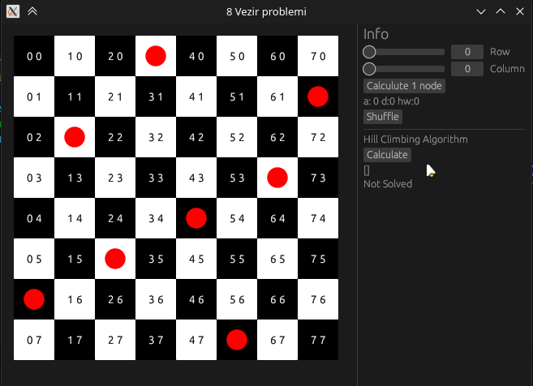

# 8-Queen Problem with Hill Climb Algorithm

This project finds solutions to the Eight Queens puzzle, which involves placing eight chess queens on an 8×8 chessboard so that no two queens threaten each other.